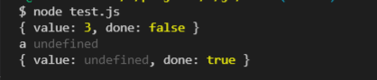

# Generator 

生成器对象是由一个 generator function 返回的,并且它符合可迭代协议和迭代器协议。

## 特点

1. yield 本身是没有返回值的，从下面的例子中在执行了两次```o.next()```后，变量 a 并没有被赋值

    ```[js]
    const gen = function* () {
        const a = yield 1 + 2
        console.log('a', a);
    }

    const o = gen()

    console.log(o.next());
    console.log(o.next());
    ```

      

2. 可以通过给 next() 传参来代替上一个 yield 语句。还是上边的例子，再给第二个 next() 传参3后，它代替了上一个 yield 语句，为变量 a 赋了值。

    ```[js]
    const gen = function* () {
        const a = yield 1 + 2
        console.log('a', a);
    }

    const o = gen()

    console.log(o.next());
    console.log(o.next(3));
    ```

## 应用场景

1. 生成迭代器

    ```[js]
    const Node = function (val, left = null, right = null) {
        this.val = val
        this.left = left
        this.right = right
    }

    const generateSearchTree = (root, val) => {
        const newNode = new Node(val)
        if (root.val > val) {
            if (!root.left) {
                root.left = newNode
            } else {
                generateSearchTree(root.left, val)
            }
        } else {
            if (!root.right) {
                root.right = newNode
            } else {
                generateSearchTree(root.right, val)
            }
        }
    }

    const Tree = function (arr) {
        this.root = null
        if (!Array.isArray(arr) || !arr.length) return
        const _root = new Node(arr[0])
        for (let i = 1; i < arr.length; i++) {
            generateSearchTree(_root, arr[i])
        }
        this.root = _root
    }

    Tree.prototype[Symbol.iterator] = function* () {
        const root = this.root
        const stack = [root]
        while (stack.length) {
            const cur = stack.pop()
            yield cur.val
            if (cur.right) stack.push(cur.right)
            if (cur.left) stack.push(cur.left)
        }
    }

    const t = new Tree([1, 3, 2, 4, 6, 8, 5])
    console.log([...t]) // [1, 3, 2, 4, 6, 5, 8]
    ```

2. 解决异步任务回调地狱问题

```[js]
const run = (fn) => {
    const gen = fn()
    const next = (data) => {
        const result = gen.next(data)
        if (result.done) return
        result.value(next)
    }
    next()
}

run(function* () {
    const a = yield (success) => {
        const timer = setTimeout(() => {
            clearTimeout(timer)
            success(1)
        }, 300)
    }
    const b = yield (success) => {
        const timer = setTimeout(() => {
            clearTimeout(timer)
            success(2)
        }, 500)
    }
    console.log(a + b) // 3
})
```