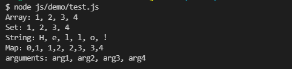

# 遍历

## for..in

for..in 遍历某个对象的整条原型链中每一层中使用 Object.keys(..) 得到的属性列表——只包含可枚举属性，因为不可使用它来遍历数组。

## for..of

for..of 循环首先会向被访问对象请求一个迭代器对象，然后通过调用迭代器对象的
next() 方法来遍历所有返回值。因此它可以访问所有可迭代对象（Array，Map，Set，String，TypedArray，arguments 对象等等）。

```[js]
const map = new Map()
map.set('Array', [1, 2, 3, 4])
map.set('Set', new Set([1, 2, 3, 4]))
map.set('String', 'Hello!')
map.set('Map', new Map([[0, 1], [1, 2], [2, 3], [3, 4]]))

for (let [type, iterator] of map) {
    let str = ''
    for (let value of iterator) {
        str += `${value}, `;
    }
    console.log(`${type}：${str.slice(0, -2)}`);
}

function func () {
    let str = ''
    for (let arg of arguments) {
        str += `${arg}, `;
    }
    console.log(`arguments：${str.slice(0, -2)}`)
}
func('arg1', 'arg2', 'arg3', 'arg4')
```
 

## for..in 与 for..of 的区别

1. for..in 返回的是键，而 for..of 返回的是迭代对象每次迭代返回的值
2. for..in 可遍历所有对象，而 for..of 只可遍历可迭代对象