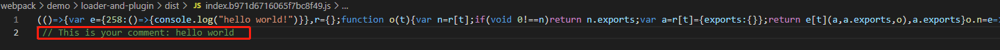

# loader和plugin

## loader

loader用于对某模块的源代码进行转化，它可以帮助我们在加载非js文件前预处理该文件。比如它可以帮助我们将ts文件转为js，获将css文件转为可被js import的形式。

- 使用方式
  
  loader有两种使用方式：
    1. 配置方式：在webpack.config.js中进行配置

    ```
    module: {
        rules: [
        {
            test: /\.css$/,
            use: [
            { loader: 'style-loader' },
            {
                loader: 'css-loader',
                options: {
                modules: true
                }
            }
            ]
        }
        ]
    }
    ```
    2. 内联方式：在每个 import语句或任何等效于 "import" 的方式中显式指定 loader。使用 ! 将资源中的 loader 分开。分开的每个部分都相对于当前目录解析。
    ```
    import Styles from 'style-loader!css-loader?modules!./styles.css';
    ```
    3. CLI方式
    ```
    webpack --module-bind jade-loader --module-bind 'css=style-loader!css-loader'
    ```

- 特性
  
  1. loader 支持链式传递。能够对资源使用流水线(pipeline)。一组链式的 loader 将按照相反的顺序执行。loader 链中的第一个 loader 返回值给下一个 loader。在最后一个 loader，返回 webpack 所预期的 JavaScript。```例： use: ['style-loader', 'css-loader']该执行由css-loader开始，至style-loader```
  2. loader 可以是同步的，也可以是异步的。
  3. loader 运行在 Node.js 中，并且能够执行任何可能的操作。
  4. loader 接收查询参数。用于对 loader 传递配置。
  5. loader 也能够使用 options 对象进行配置。
  6. 除了使用 package.json 常见的 main 属性，还可以将普通的 npm 模块导出为 loader，做法是在 package.json 里定义一个 loader 字段。
  7. 插件(plugin)可以为 loader 带来更多特性。
  8. loader 能够产生额外的任意文件。

- 自定义loader

  loader本质是一个函数，当它被作为第一个解析资源的loader时，它只有一个参数，即资源的文件内容字符串，loader 需要解析该字符串并进行转化。而它在链式调用时，除第一个被调用的 loader ，其它 loader 的入参都是上一个 loader 的出参。
  ```
  webpack.config.js
  const path = require('path')
  module.exports = {
      entry: {
          'index': path.resolve(__dirname, './index')
      },
      module: {
          rules: [
              {
                  test: /\.txt/,
                  use: [ // 调用顺序为txt-loader、str-loader
                      path.resolve(__dirname, './str-loader'), 
                      {
                          loader: path.resolve(__dirname, './txt-loader'), 
                          options: {
                              name: 'world'
                          }
                      }
                  ]
              }
          ]
      }
  }

  index.js
  import './test.txt'

  txt-loader.js
  const utils = require('loader-utils')
  exports.default = function (source) {
      const { name = 'nan' } = utils.getOptions(this)
      return source.replace('[name]', name)
  }

  str-loader.js
  exports.default = function (str) {
    return `console.log('${str}')`
  }

  test.txt
  hello [name]!
  ```
  从下图可以看到 txt-loader 通过 loader-utils 里的 getOptions 方法拿到了webpack.config.js传入的参数，并替换了 test.txt 里面的```[name]```，然后再链式调用了str-loader，此时传入 str-loader 也并非为 test.txt 的内容字符串了，而是 txt-loader 传出的参数。

    


## plugin

plugin 是一个具有 apply 方法的 JavaScript 对象。apply 方法会被 webpack 编辑器调用，并且在 整个 编译生命周期都可以访问 compiler 对象。插件目的在于解决 loader 无法实现的其他事

- 用法

  由于插件可以携带参数/选项，在使用 plugin 时， 必须在 webpack 配置中，向 plugins 属性传入一个 new 实例，而根据你对 webpack 的用法，主要有两种使用插件的方法
  1. 配置方式
  ```
  const HtmlWebpackPlugin = require('html-webpack-plugin'); // 通过 npm 安装
  const webpack = require('webpack'); // 访问内置的插件
  const path = require('path');
  module.exports = {
    entry: './path/to/my/entry/file.js',
    output: {
        filename: 'my-first-webpack.bundle.js',
        path: path.resolve(__dirname, 'dist'),
    },
    module: {
        rules: [
        {
            test: /\.(js|jsx)$/,
            use: 'babel-loader',
        },
        ],
    },
    plugins: [
        new webpack.ProgressPlugin(),
        new HtmlWebpackPlugin({ template: './src/index.html' }),
    ],
  };
  ```
  2. Node API 方式
  ```
  const webpack = require('webpack'); // 访问 webpack 运行时(runtime)
  const configuration = require('./webpack.config.js');
  let compiler = webpack(configuration);
  new webpack.ProgressPlugin().apply(compiler);
  compiler.run(function (err, stats) {
    // ...
  });
  ```

- 自定义 plugin
  
  plugin 本质上是通过编译器上的生命周期钩子注册回调进行操作的方法，下面是一个为所有输出文件加上注释的插件  
  
  ```compilation：compilation 实例能够访问所有的模块和它们的依赖（大部分是循环依赖）。 它会对应用程序的依赖图中所有模块， 进行字面上的编译(literal compilation)。 在编译阶段，模块会被加载(load)、封存(seal)、优化(optimize)、 分块(chunk)、哈希(hash)和重新创建(restore)。```
  ```
  comment-plugin.js
  const { ConcatSource } = require('webpack-sources')
  exports.default = class CommentPlugin {
      constructor (options) {
          const comment = options.comment
          this.comment = `This is your comment: ${comment}`
      }
      apply (compiler) {
          compiler.hooks.emit.tapPromise('emit', (compilation) => {
              return new Promise((resolve) => {
                  const assets = compilation.getAssets()
                  assets.forEach((file) => {
                      console.log('file: ', file);
                      compilation.updateAsset(file.name, (old) => {
                          console.log('old: ', old);
                          console.log('file.source: ', file.source.constructor.prototype);
                          return new ConcatSource(old, "\n // ", this.comment)
                      })
                  })
                  resolve()
              }).then(() => {
                  console.log('hook:emit');
              });
          });
      }
  }

  webpack.config.js
  const CommentPlugin = require('./comment-plugin').default
  const path = require('path')
  module.exports = {
      entry: {
          'index': path.resolve(__dirname, './index')
      },
      output: {
          path: path.resolve(__dirname, 'dist'),
          filename: '[name].[chunkhash].js'
      },
      module: {
          rules: [
              {
                  test: /\.txt/,
                  use: [
                      path.resolve(__dirname, './str-loader'), 
                      {
                          loader: path.resolve(__dirname, './txt-loader'),
                          options: {
                              name: 'world'
                          }
                      }
                  ]
              }
          ]
      },
      plugins: [
          new CommentPlugin({ comment: 'hello world' })
      ]
  }
  ```
  
    
