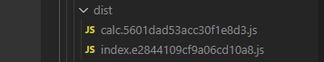
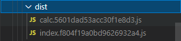
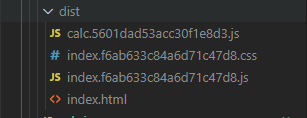
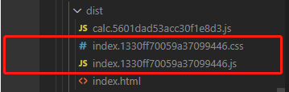
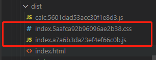
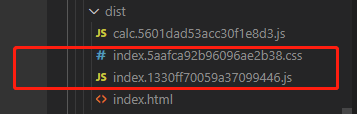

# filename中几种hash类型

- ## hash: 
    项目中任意文件修改都会变化，且所有输出的bundle文件的hash都是一致的，因此适用场景不多；
    
- ## chunkhash: 
    chunkhash会根据不同的入口文件构建生成的chunk，生成不同的hash。在生产环境中，我们可以将部分公共库代码独立为一个入口，而公共库的代码一般不会频繁进行更改，从而实现一个缓存优化。
    ```
    [webpack.config.js]
    const path = require('path');
    module.exports = {
        entry: {
            index: path.resolve(__dirname, './index'),
            calc: path.resolve(__dirname, './calc')
        },
        output: {
            path: path.resolve(__dirname, 'dist'),
            filename: '[name].[chunkhash].js'
        }
    }

    [index.js]
    import calc from './calc.js'
    calc(1, 2)
    calc(2, 2)
    console.log('this is index.js')

    [calc.js]
    export default (a, b) => a + b
    ```
    构建上面的代码可以看到不同入口的bundle的hash是不同的。
      

    此时我们修改index.js中代码，可以看到此时输出的文件只有index的hash发生了变化
    ```
    [index.js]
    import calc from './calc.js'
    calc(1, 2)
    console.log('this is index.js')
    ```
      

    而chunkhash的使用也有另一个问题，例如我们在js中引用css文件时，由于chunkhash是根据入口文件及其依赖关系来生成hash的，一旦依赖文件发生变化，hash也会随之变化。而实际情况中，我们常常会将css文件抽离出来，这时当js文件发生变化时，我们是不希望其依赖的css文件也随之更新缓存的。
    ```
    index.css
    .box {
        height: 100px;
        width: 50px;
    }

    index.js
    import calc from './calc.js'
    import './index.css'
    calc(1, 2)
    console.log('this is index.js')
    ```
      
    从上图可看到css文件即使单独抽离出来，其hash也是与js一致的，然后我们修改css文件的内容。
    ```
    index.css
    .box {
        height: 100px;
        width: 50px;
        background: #fff;
    }
    ```
      
    可以看到css、js文件的hash都发生了改变

- ## contenthash: 
    
    contenthash是根据当前文件的内容生成的hash，只有当前文件的内容发生了变化，hash值才会改变，而与其依赖文件无关。返回上面的例子，我们可以将css文件的输出filename单独设为contenthash的形式，这样当index.js的内容改变时，就可以保证index.css的输出文件hash不变了。
    ```
    webpack.config.js
    const path = require('path');
    const { CleanWebpackPlugin } = require('clean-webpack-plugin');
    const HtmlWebpackPlugin = require('html-webpack-plugin');
    const MiniCssExtractPlugin = require('mini-css-extract-plugin');

    module.exports = {
        entry: {
            index: path.resolve(__dirname, './index'),
            calc: path.resolve(__dirname, './calc')
        },
        output: {
            path: path.resolve(__dirname, 'dist'),
            filename: '[name].[chunkhash].js'
        },
        module: {
            rules: [
                {
                    test: /\.css$/i,
                    use: [MiniCssExtractPlugin.loader, 'css-loader'],
                },
            ],
        },
        plugins: [
            new CleanWebpackPlugin(),
            new MiniCssExtractPlugin({
                    filename: '[name].[contenthash].css'
            }),
            new HtmlWebpackPlugin({
                title: 'webpack-demo',
            }),
        ]
    }
    ```
    修改index.js之前  
       
    修改index.js之后，可以发现这次的index.css的hash并未随之改变
       
