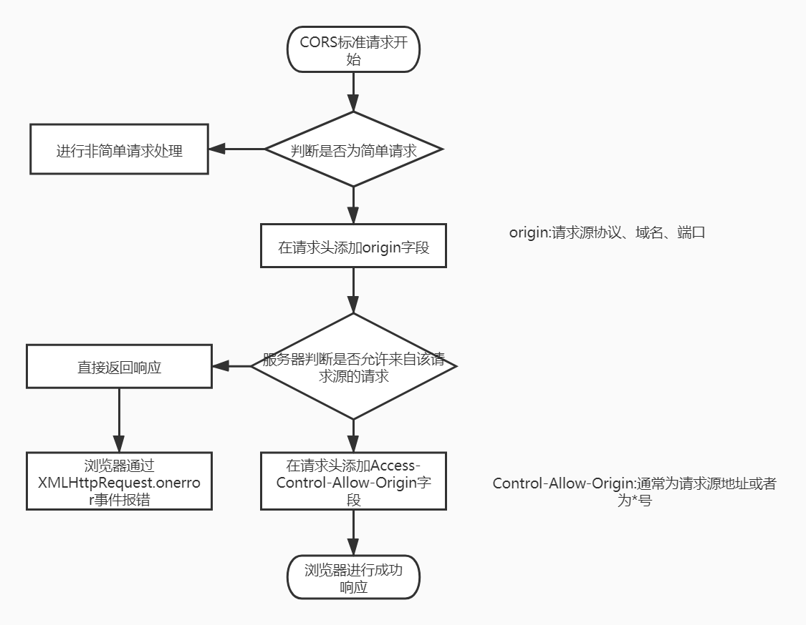
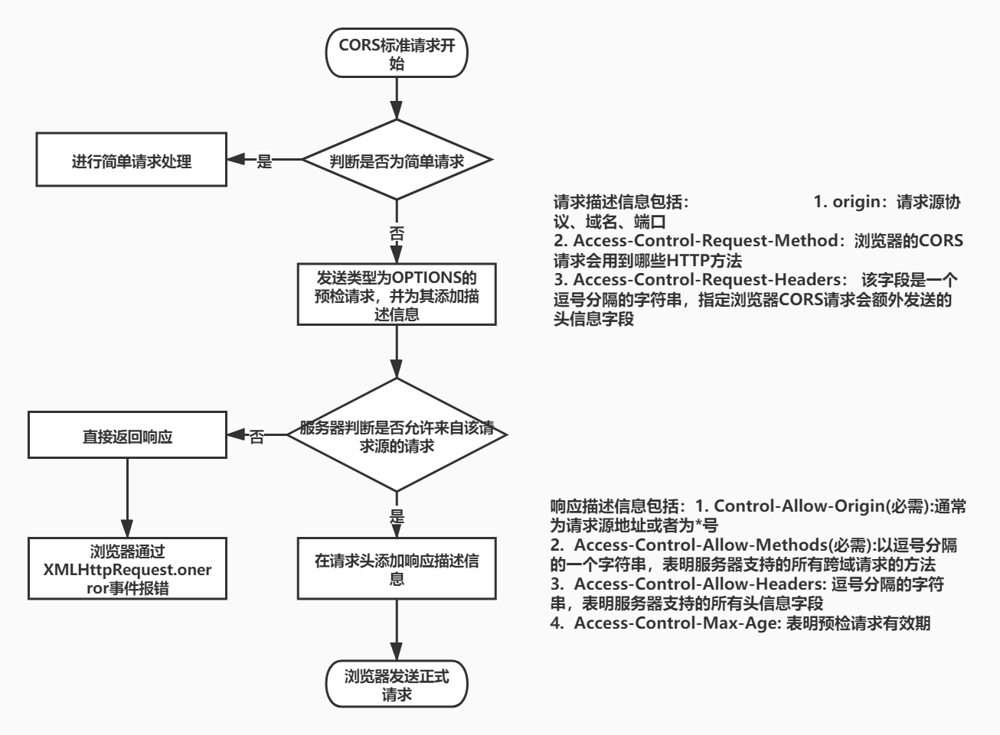

# CORS 标准

## 概念

CORS(Cross-Origin Resource Sharing)：跨域资源共享标准是一种 W3C 标准，它需要浏览器和服务器同时支持。目前，所有浏览器都支持该功能，IE 浏览器不能低于 IE10。实现 CORS 通信的关键是服务器。只要服务器实现了 CORS 接口，就可以跨源通信。它将请求分为了简单请求和非简单请求两类。

## 简单请求

- 满足条件：

1. 请求方法为 HEAD、GET、POST 方法之一
2. HTTP 的头信息不超出以下几种字段:
   - Accept（客户端希望接受的数据类型）
   - Accept-Language（客户端希望接受的语言）
   - Content-Language（参数的语言）
   - Last-Event-ID
   - Content-Type（参数的数据类型）：只限于三个值 application/x-www-form-urlencoded、multipart/form-data、text/plain

- 请求流程

## 非简单请求

- 满足条件：不满足简单请求条件的即为非简单请求
- 请求流程
  

## 携带 cookie

CORS 请求默认不发送 Cookie 和 HTTP 认证信息。如果要把 Cookie 发到服务器，一方面要服务器同意，指定 Access-Control-Allow-Credentials 字段, 如在第一个简单请求或者非简单请求的预请求的响应头中携带，另一方面，开发者必须在 AJAX 请求中打开 withCredentials 属性。
