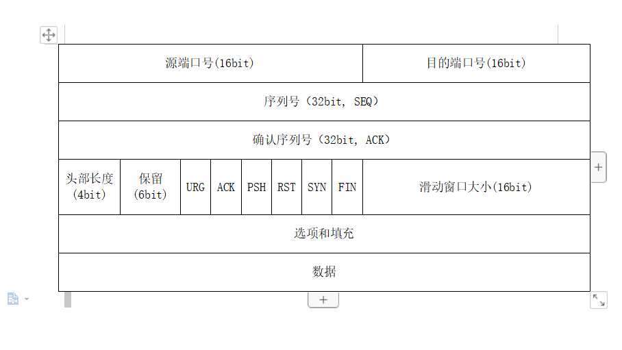

# TCP 协议

## 定义

TCP（Transmission Control Protocol）：传输控制协议是一种面向连接的、可靠的、基于字节流的传输层通信协议.

## TCP 报文

- SYN(Synchronize Sequence Numbers): 同步序列号标志位，当其为 1 时即说明该报文为建立连接报文，ACK 标志位为 0 为客户端发送给服务端的建立连接请求报文、而 ACK 为 1 则为建立连接响应报文
- ACK(Acknowledge): 确认序号标志，为 1 时表示确认号有效，为 0 表示报文中不含确认信息，忽略确认号字段
- FIN(Finish): 用来释放连接。当 FIN=1 时，表明此报文段的发送方的数据已发送完毕，并要求释放运输连接。
- SEQ(Sequenue Number): 同步序列号
- 确认序号：Acknowledgment Number：是期望收到对方下一个报文段的第一个数据字节的序号。若确认序号=N,则表明：到序号 N-1 为止的所有数据都已正确收到

## TCP 连接建立过程(三次握手)

1. 客户端首先发送建立连接请求报文，将 SYN 标志设为 1，ACK 标志位为 0，请求序列号设为一个随机生成的值 X（TCP 规定 SYN=1 时不能携带数据），然后进入 SYN_SEND 状态
2. 服务端收到连接建立请求报文后，如果同意连接，则发出确认报文，同时将 SYN 标志设为 1，ACK 标志位为 1，请求序列号设为一个随机值 Y，确认序列号设为 X + 1，此时服务端转为 ACK-RCVD（同步收到）状态
3. 客户端收到服务端的确认报文后，再次向客户端发出确认报文，同时设置 ACK 为 1，确认序列号 为 Y+1，请求序列号为 X+1，至此 TCP 连接已经建立，此时客户端进入 ESTABLISHED（已建立连接）状态。TCP 规定，ACK 报文段可以携带数据，但是如果不携带数据则不消耗序号。
4. 服务端在收到客户端的确认报文后可以变为 ESTABLISHED（已建立连接）状态，即可以正式进行通信

- 三次握手原因  
  1. 防止第一次建立连接请求在某个网络结点滞留，服务端无法及时返回确认请求，此时客户端会认为请求已经丢失，则重新发送建立连接请求，与服务端进行连接通信，在通信结束后，断到该连接。客户端、服务端都变为 CLOSED 状态，而前面滞留的请求此时如果到达服务端，服务端根据该请求返回响应同时转为连接已建立的状态，而客户端此时收到响应报文后，由于处于 CLOSED 状态，会抛弃该响应报文，服务端则会一直等待客户端的通信，造成资源的浪费。
  2. 确保通信双方的发送、接受能力。

## TCP 连接断开过程(四次挥手)

1. 客户端进程发出连接释放报文，并且停止发送数据。释放数据报文首部，FIN=1，其序列号为seq=u（等于前面已经传送过来的数据的最后一个字节的序号加1），此时，客户端进入FIN-WAIT-1（终止等待1）状态。 TCP规定，FIN报文段即使不携带数据，也要消耗一个序号。
2. 服务器收到连接释放报文，发出确认报文，ACK=1，ack=u+1，并且带上自己的序列号seq=v，此时，服务端就进入了CLOSE-WAIT（关闭等待）状态。TCP服务器通知高层的应用进程，客户端向服务器的方向就释放了，这时候处于半关闭状态，即客户端已经没有数据要发送了，但是服务器若发送数据，客户端依然要接受。这个状态还要持续一段时间，也就是整个CLOSE-WAIT状态持续的时间。
3. 客户端收到服务器的确认请求后，此时，客户端就进入FIN-WAIT-2（终止等待2）状态，等待服务器发送连接释放报文（在这之前还需要接受服务器发送的最后的数据）。
4. 服务器将最后的数据发送完毕后，就向客户端发送连接释放报文，FIN=1，ack=u+1，由于在半关闭状态，服务器很可能又发送了一些数据，假定此时的序列号为seq=w，此时，服务器就进入了LAST-ACK（最后确认）状态，等待客户端的确认。
5. 客户端收到服务器的连接释放报文后，必须发出确认，ACK=1，ack=w+1，而自己的序列号是seq=u+1，此时，客户端就进入了TIME-WAIT（时间等待）状态。注意此时TCP连接还没有释放，必须经过2∗ *∗MSL（最长报文段寿命）的时间后，当客户端撤销相应的TCB后，才进入CLOSED状态。
6. 服务器只要收到了客户端发出的确认，立即进入CLOSED状态。同样，撤销TCB后，就结束了这次的TCP连接。可以看到，服务器结束TCP连接的时间要比客户端早一些。

- 四次挥手的原因：  
  由于 TCP 是全双工通信，被动关闭方在接受到主动关闭方 FIN 报文后会关闭读的通道，但此时可能因为被动关闭方还有数据需要发给对方，所以进入 CLOSE_WAIT 状态，待全部数据发送完毕之后才发送 FIN 报文给主动关闭方，实现双方所有通道的关闭

- 主动关闭方响应被动方的 FIN 报文后需要进入 TIME_WAIT 状态，等待两个报文最大生存时间的原因在于为了防止该响应报文丢失，造成被动关闭方再次发送 FIN 报文无响应的情况

## TCP 与 UDP 的区别

1. 连接性：TCP是面向连接的协议，在收发数据前必须通过三次握手与接收方建立起可靠的连接; UDP是一个面向无连接的协议，发送端尽可能快的将数据扔到网络上，接收端从消息队列中读取消息段。
2. 可靠性：TCP提供可靠交付的服务，传输过程中采用编号与确认、流量控制、计时器等方法保证在连接上提供可靠的传输服务; UDP使用尽可能最大努力交付，但不保证可靠交付。
3. 首部：TCP报文首部有20个字节，额外开销大;UDP报文首部只有8个字节。
4. 双工性：TCP只能点对点全双工通信;UDP支持一对一、一对多、多对一和多对多的交互通信。