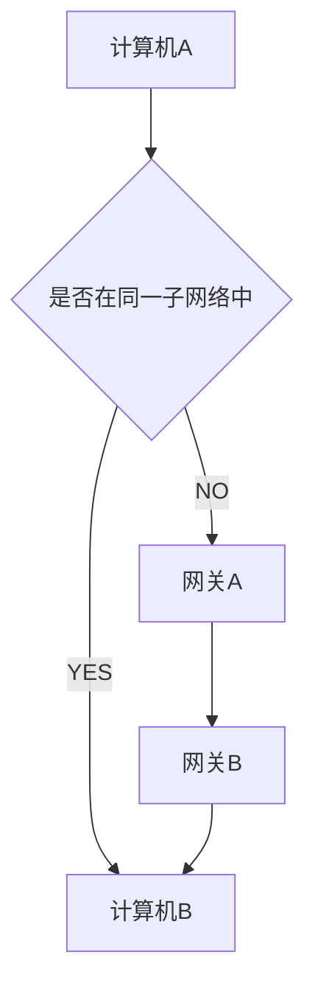

# 互联网协议

## 定义：实现互联网每层结构功能必须要遵守的规则

## 互联网五层结构（越往下越靠近硬件，往上越靠近用户）

- 应用层
- 传输层
- 网络层
- 链路层
- 实体层(物理层)

### 1. 实体层

通过光缆、电缆、无线电波将电脑链接起来，相关协议主要规定了网络的电气特性，作用负责传送 0 和 1 的电信号

### 2. 链路层

#### 2.1 功能及特点

- 确定了 0 和 1 的分组方式
- 主导协议为以太网协议

#### 2.2 以太网协议

以太网规定，一组电信号构成一个数据包，叫做"帧"（Frame）。每一帧分成两个部分：标头（Head）和数据（Data）。

- "标头"包含着数据包的一些说明项，比如发送者、接受者、数据类型等等；"数据"则是数据包的具体内容。
- "标头"的长度，固定为 18 字节。"数据"的长度，最短为 46 字节，最长为 1500 字节。因此，整个"帧"最短为 64 字节，最长为 1518 字节。如果数据很长，就必须分割成多个帧进行发送。

#### 2.2 MAC 地址

- 以太网中规定，连入网络的所有设备，都必须具有"网卡"接口。数据包必须是从一块网卡，传送到另一块网卡。网卡的地址，就是数据包的发送地址和接收地址，这叫做 MAC 地址。
- 每块网卡有着唯一的 MAC 地址，长度是 48 个二进制位，通常用 12 个十六进制数表示。前 6 个十六进制数是厂商编号，后 6 个是该厂商的网卡流水号。

#### 2.3 广播

发送方想要发送数据到接收方时，发送方会向网内所有的计算机发送，让其他计算机根据 MAC 地址比较，自行判断自己是否为接收方。

### 3. 网络层

#### 3.1 由来

由于以太网络的广播发送方式，它限制了计算机只能向同一子网络中的其他计算机发送数据，而全世界的计算机不可能存在于同一子网络，同时一旦子网络包含的计算机过多，广播要向所有其它计算机发送数据包，这也极大地影响到了发送速度  
因此必须出现了网络层，它的作用就是引入了网络地址，用来确定当前存在的子网络，判别两个计算机是否存在于同一子网络中，一旦存在则采用广播方式发送，若不存在则采用“路由”的方式向不同的计算机网络的发送数据包

#### 3.2 IP 协议

- 定义：规定网络地址的协议。它所定义的地址，就被称为 IP 地址。目前，广泛采用的是 IP 协议第四版，简称 IPv4。这个版本规定，网络地址由 32 个二进制位组成
- 习惯上我们用分成四段的十进制数表示 IP 地址，从 0.0.0.0 一直到 255.255.255.255。
- 互联网上的每一台计算机，都会分配到一个 IP 地址。
- IP 地址被分为网络部分和主机部分两个部分，单从 IP 地址上我们无法看出网络部分时是哪一个部分，若我们要判断两台计算机是否存在于同一子网络内，我们可将两个计算机的 IP 地址分别与描述有有该子网络特征的**子网掩码**(它与 IP 地址形式类似，也是由 32 位二进制数组成)进行 AND 运算，如果两个计算结果相同则说明两计算机存在于同一子网络中
- IP 数据包
  - 根据 IP 协议发送的数据称为 IP 数据包，它分为标头和数据两个部分，"标头"部分主要包括版本、长度、IP 地址等信息，数据部分则是 IP 数据包的具体内容。
  - IP 数据包的"标头"部分的长度为 20 到 60 字节，整个数据包的总长度最大为 65,535 字节。因此，理论上，一个 IP 数据包的" 数据"部分，最长为 65,515 字节。
  - IP 数据包可以放入以太网数据包的数据部分，因此不需要在以太网数据包中增加栏位来存放它，注意，如果 IP 数据包超过 1500 个子节（以太网数据包数据部分能存放的最大子节数），则需要多个以太网数据包来存放它
- ARP（Address ResoluTIon Protocol）：地址解析协议
  - 原理：同一子网络中，ARP 协议发出一个数据包（包含在以太网数据包中），该数据包含了它要查询的主机的 IP 地址，在接收者 MAC 地址这一栏，填的是 FF:FF:FF:FF:FF:FF，表示这是一个"广播"地址。它所在子网络的每一台主机，都会收到这个数据包，从中取出 IP 地址，与自身的 IP 地址进行比较。如果两者相同，都做出回复，向对方报告自己的 MAC 地址，否则就丢弃这个包。
  - 因此计算机就可利用 ARP 协议，向任一 MAC 地址的主机发送数据包

### 4. 传输层

#### 4.1 传输层由来

- 通过 IP 地址和 MAC 地址建立起主机的连接后，为了让接受数据包的主机知道该数据包是给哪个程序使用的，引入了**端口**这个参数
  1. 端口它是主机上每一个使用网卡的程序的编号，用来标识数据包该发到哪个编号的程序上。
  2. "端口"是 0 到 65535 之间的一个整数，正好 16 个二进制位。
  3. 0 到 1023 的端口被系统占用，用户只能选用大于 1023 的端口。
- 而传输层就是实现了端口与端口之间进行通信的功能，满足了程序与程序之间的连接

#### 4.2 UDP 协议

- 用来存放端口信息，它是以标头和数据两部分格式组成，数据发送时，它被放在 IP 数据包的“数据”部分
- "标头"部分一共只有 8 个字节，总长度不超过 65,535 字节，正好放进一个 IP 数据包。
- 缺点：比较简单，容易实现，但是缺点是可靠性较差，一旦数据包发出，无法知道对方是否收到。

#### 4.3 TCP 协议（Transmission Control Protocol）：传输控制协议

- 可近似认为 TCP 协议就是有确认机制的 UDP 协议，每发出一个数据包都要求确认。如果有一个数据包遗失，就收不到确认，发出方就知道有必要重发这个数据包了。
- TCP 数据包放在 IP 数据包的“数据”部分，理论上它没有大小限制，不过通常情况下它不会大于一个 IP 数据包最大字节数，以免一个 TCP 数据包被切割

### 5. 应用层

- 规定应用程序的数据格式。
- 应用层的数据包放在 TCP 数据包的“数据”部分

---

### 互联网五层结构相关协议数据包图

#### 计算机 A 发送数据包到计算机 B 流程

1. 同一子网络中，数据包中包含了计算机 B 的 MAC 地址和 IP 地址
2. 不同子网络中，数据包中包含了网关 A 的 MAC 的地址和计算机 B 的 IP 地址
